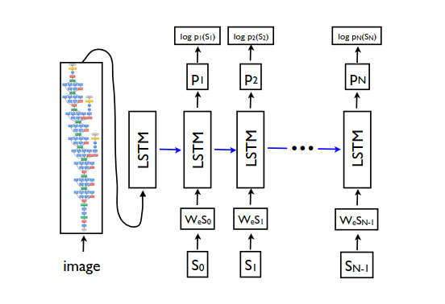

### A Neural Image Caption Generator

1. [Introduction](#introduction)
2. [Architecture](#architecture)

#### Introduction

- This is a neural image caption generator based on the paper [Show and Tell: A Neural Image Caption Generator](https://arxiv.org/abs/1411.4555) by Vinyals et al.
- The model is trained on the [Flickr8k](https://www.kaggle.com/adityajn105/flickr8k) dataset.

#### Architecture

- The pytorch implementation can be found in `encoder_decoder.py`.

#### Encoder
- The encoder is an EfficientNet with weights pretrained on ImageNet.
- The final layer of the EfficientNet is removed and the output of the penultimate layer is used as the image embedding, which is then passed to the decoder.
- The image embedding is passed through a linear layer to reduce the dimensionality of the feature vector to the dimensionality of the joint embedding space.

#### Decoder
- The decoder is an LSTM which generates a caption for the image.
- At the start of the decoding process, the feature vector from the encoder is passed through the LSTM to allow the hidden state to view the embedded representation of the image.
- A linear layer is added in order to map the hidden state outputs to the vocabulary space, in order to generate a probability distribution over the next word in the caption.